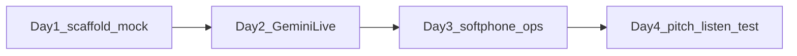

# Development time plan

Build the Amber IT Gemini helpline demo: browser softphone, supervisor `/ops`, mock data. IP-PBX is later.

## Estimate

- **One developer, 4 working days (~5–6 hours/day, ~22 hours)**
- Extra days are buffer for Gemini audio, UI polish, and Banglish listen-testing — not extra features
- **Fallback if Gemini WebSocket in Next.js is awkward:** small Node `ws` proxy beside Next.js (`server/live-proxy.ts`). Same `lib/agent`. No scope change
- **Not in this clock:** IP-PBX, real APIs, OpenAI A/B

## Day 1 — Scaffold and mock world (~5.5h)

Use this day to make the app and data real.

- `create-next-app` (App Router, TypeScript, Tailwind)
- Amber-red home, Call / Ops entry points (pages can be placeholders)
- `.env.local.example` with `GEMINI_API_KEY`
- 6–8 customers (CID, area, package, bill, ONU)
- Packages 20 Mbps ৳500 … 250 Mbps ৳2500, troubleshooting scripts
- In-memory tickets and outages
- Plain TypeScript tool functions so Gemini can call them tomorrow

**Done when:** `npm run dev` shows a branded home page; lookup by CID returns a customer without any voice yet.

## Day 2 — Gemini Live agent (~6h, critical path)

- Server WebSocket proxy → `gemini-live-2.5-flash-native-audio`
- Browser: mic 16 kHz PCM in, 24 kHz playback out
- Nusrat instructions (Bangla/English/mix, no `language_code` lock, never “I am AI”)
- Wire tools: `lookupCustomer`, `getBill`, `checkAreaOutage`, `createTicket`, `listPackages`, `escalateToHuman`
- A simple live event log (transcript + tool calls) even if `/ops` UI is still rough

**Done when:** you can speak Banglish into the mic, hear Nusrat, and a ticket appears in memory after “internet nai.”

If blocked: keep Next.js for UI; run audio as `server/live-proxy.ts`. Do not rewrite the agent.

## Day 3 — Softphone and supervisor (~5.5h)

- **`/call`:** ring, connected, mute, hang up, 09611-123123 chrome. Captions off by default
- **`/ops`:** live transcript, customer card, ticket list, handoff card
- Scene toggles: Gulshan outage, unpaid bill
- Keep caller + ops in sync on one call (two browser windows)

**Done when:** two windows stay in sync for a full mock call, including escalate-to-human.

## Day 4 — Pitch, listen-test, polish (~5h)

- Walk the five-step pitch (outage → bill → upgrade → barge-in → human) end to end
- Headphones listen-test of mixed Bangla/English; tweak Nusrat prompt if she drifts to English
- Tighten UI, ring/connect timing, error states (mic denied, missing API key)
- `README.md`: run, key, two-window demo, Phase 2 IP-PBX note
- Dry-run as if Amber IT is in the room

**Done when:** the five-step pitch runs without leaving `/call` and `/ops`, and Banglish sounds acceptable on headphones.

## Definition of done

- `/call` rings and Nusrat answers in bn-BD / mix
- Tools hit mock data; tickets and escalate show on `/ops`
- Scene toggles change what she says mid-demo
- No SIP, no real Amber IT APIs

## Prerequisite

Gemini API key with Live / native-audio in `.env.local`. Without it, Day 1 can still finish; Day 2 cannot.
