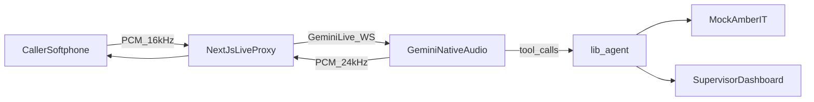
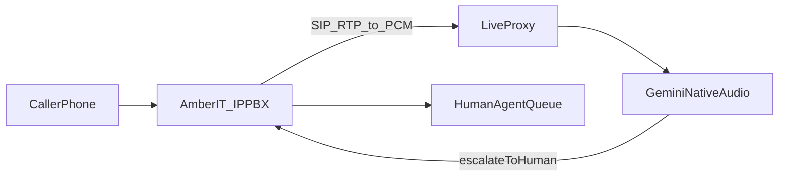

# Amber IT AI Helpline Demo

Companion schedule: [DEV_PLAN.md](./DEV_PLAN.md)

Pitch-ready Amber IT helpline demo. Gemini Live native audio (bn-BD) answers in Bangla, English, or mixed speech via a browser softphone. Supervisor screen shows the live call. IP-PBX is the next phase, not this build.

## Locked decisions

- **Goal:** sales demo of an AI that answers like Amber IT 24/7 support. Not a live BTRC number.
- **Languages:** Bangla, English, and mixed Dhaka Banglish. Mirror the caller. Do not lock `language_code`.
- **Voice:** Gemini Live native audio (`gemini-live-2.5-flash-native-audio`), locale **bn-BD**. Not OpenAI gpt-realtime-2.1 (language drift; Bangla is not a first-class spoken output).
- **This build:** browser softphone + supervisor dashboard + mocked Amber IT data.
- **Next build:** same agent on Amber IT **IP-PBX** (SIP in, human transfer out). Do not implement SIP now.
- **Honesty:** optimize so the caller does not notice it is AI; do not guarantee it. Listen-test Banglish before the pitch.

## Product

Two pages that can run side by side on one laptop:

1. **Caller** (`/call`) — looks like dialing **09611-123123**. Ring → Nusrat picks up. Mute / hang up. Captions off by default.
2. **Supervisor** (`/ops`) — live transcript, tool calls, customer card, tickets. Presenter toggles: Gulshan outage, unpaid bill. This is the screen Amber IT management watches.

Agent **Nusrat** (warm female Gemini voice, e.g. Sulafat):

- Greeting: *“Amber IT, assalamu alaikum, ami Nusrat. Apnake kivabe help korte pari?”*
- Short turns, confirm CID or registered mobile, then act
- Never volunteer “I am an AI”

## Architecture

Keep support logic separate from audio transport so IP-PBX is an adapter later.

- **App:** Next.js App Router, TypeScript, Tailwind, Amber-red branding
- **Voice path:** browser mic → `app/api/live` WebSocket proxy → Gemini Live. Key stays on the server (`GEMINI_API_KEY`)
- **Agent:** `lib/agent/amber-agent.ts` owns instructions + tools
- **Voice adapter:** `lib/voice/gemini-live.ts` owns PCM, VAD/barge-in, transcripts
- **Data:** in-memory mock (no myswift / ticketing APIs)

### Tools

- `lookupCustomer` — CID or phone → name, area, package, ONU status
- `getBill` — due amount, due date, pay via bKash / Nagad / Rocket / myswift
- `checkAreaOutage` — e.g. Gulshan PON down + ETA
- `createTicket` — complaint id read back to the caller
- `listPackages` — MINOR+ 20 Mbps ৳500 … POSITIVE+ 250 Mbps ৳2500 (+5% VAT)
- `escalateToHuman` — parks the call; ops shows a handoff card. Phase 2: SIP transfer to a live queue

### Mock world

5–8 customers (Gulshan, Badda, Dhanmondi, …) with CID, package, bill, ONU. Knowledge for no-internet (ONU lights), billing, upgrade/downgrade, new connection → sales **09611-933933**.

## Pitch script

1. Bangla: “Internet nai, ONU te lal light.” → outage found, ticket id spoken
2. English: “What’s my bill?” → amount + bKash Pay Bill path
3. “Upgrade to 200 Mbps.” → CONFIDENT+ ৳2000 + VAT, commercial ticket
4. Barge-in while she is talking → she stops and continues
5. “I want a human.” → handoff on `/ops`

## Phase 2 — IP-PBX (later)

Amber IT already runs IPTSP / IP-PBX. Real DID hits the PBX; AI is a SIP endpoint; `escalateToHuman` becomes a queue transfer.

Reuse the same 16 kHz PCM + `lib/agent`. Add caller ANI into `lookupCustomer`. CDR/recording stay on the PBX.

## Layout

- `app/page.tsx` — home + Call
- `app/call/page.tsx` — softphone
- `app/ops/page.tsx` — supervisor
- `app/api/live/route.ts` — Gemini proxy
- `lib/agent/amber-agent.ts`
- `lib/voice/gemini-live.ts`
- `lib/kb/packages.ts`, `lib/kb/troubleshooting.ts`
- `lib/mock/customers.ts` + tickets / outages
- `README.md` — run steps, pitch script, Phase 2 notes

## Out of scope (this build)

- IP-PBX, SIP, BTRC DID
- Live myswift / ticketing.amberit.com.bd
- Production SLA, PCI, call recording retention
- Dual OpenAI/Gemini toggle

## Prerequisite

`GEMINI_API_KEY` in `.env.local` (Google AI Studio, Live / native-audio). Browser mic permission on the demo laptop.
